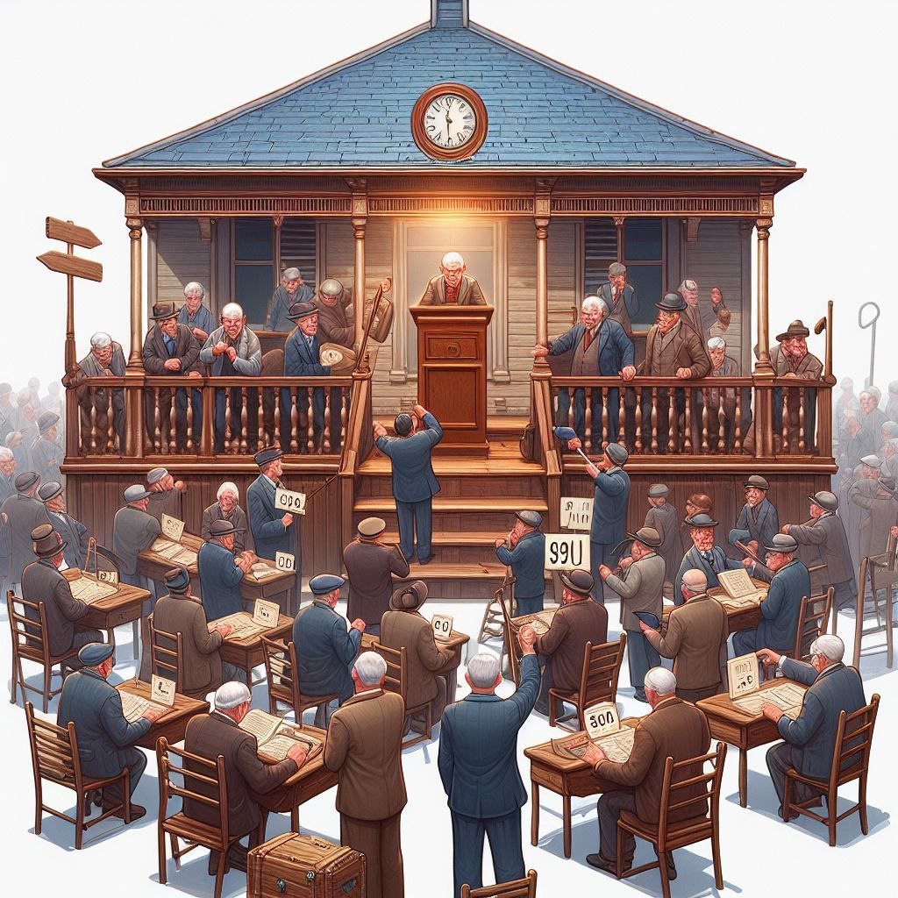
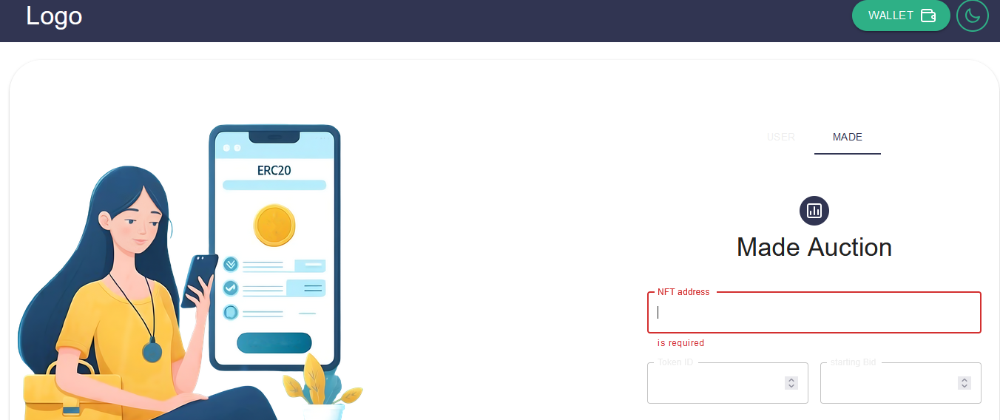
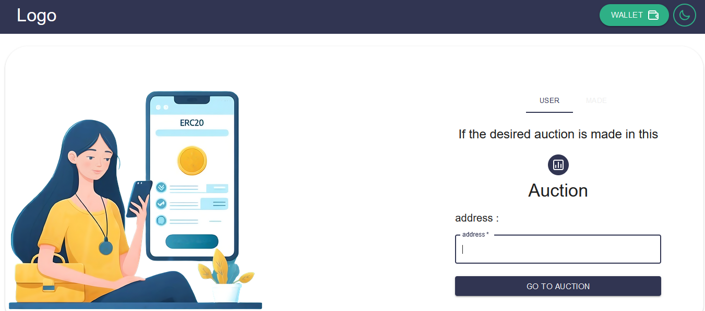
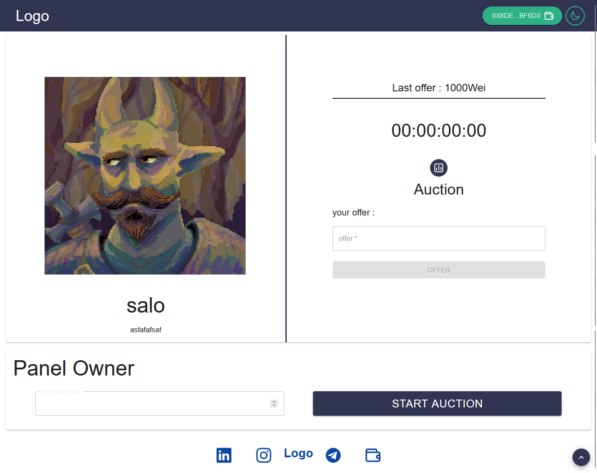

# Auction

Sell your NFT by creating an auction
An NFT auction is like a digital art sale where people bid on unique digital items, like artwork or collectibles, over the internet. The seller sets a starting price and a time limit. Bidders place their offers, and when the time's up, the highest bid wins the NFT. It's a modern twist on traditional auctions but for digital treasures.

## made & login page image

## auction page image

## Clone Repository

git clone https://github.com/mahdiZarrei/Auction.git
cd Auction-Dapp

## Requirements

[node.js](https://nodejs.org/en/) v10.18.0+ And [Metamask](https://metamask.io/) extension on your browser

## Installation

Use the package manager [npm](https://www.npmjs.com/) to install Auction.

npm install

## Usage

npm run dev

Open localhost:5173 to access the application!

## License

MIT
